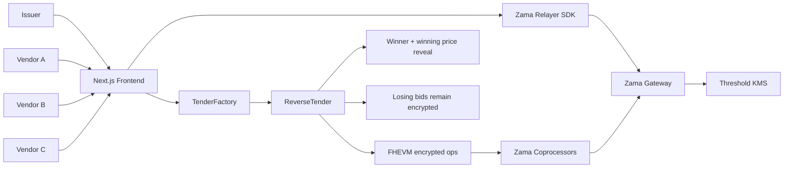

# TenderShield

Privacy-first procurement. Encrypted supplier bids. Verifiable winner selection. No quote leakage.

## Problem

Public procurement on a normal public blockchain leaks every supplier quote. That destroys the sealed-bid property and makes undercutting, copycat bidding, and collusion much easier.

## Solution

TenderShield is a confidential reverse-tender dApp built around Zama FHEVM:

- vendors encrypt bid amounts before submission
- the smart contract compares encrypted bids with `FHE.lt`
- the contract selects the encrypted minimum with `FHE.select`
- only the winner and winning price are revealed after close
- losing bids remain encrypted

## Why Zama

- FHEVM encrypted types let the contract store encrypted bid handles instead of plaintext values.
- `FHE.fromExternal` converts relayer-generated encrypted inputs into contract-usable encrypted values.
- `FHE.allowThis` preserves ACL access so the contract can reuse encrypted bids later.
- `FHE.lt` enables encrypted comparisons.
- `FHE.select` replaces impossible plaintext branching over encrypted booleans.
- `FHE.makePubliclyDecryptable` marks only the aggregate result for reveal.
- `FHE.checkSignatures` verifies the public decrypt result onchain.

## Architecture



## Smart Contracts

- `packages/contracts/contracts/TenderFactory.sol`
  - creates tenders
  - indexes tenders globally and by issuer
- `packages/contracts/contracts/ReverseTender.sol`
  - accepts encrypted bids through `externalEuint64`
  - computes the encrypted minimum after deadline
  - exposes only bidder addresses publicly
  - marks only the final result handles as publicly decryptable
  - verifies decryption signatures on finalization
- `packages/contracts/contracts/TenderToken.sol`
  - simple demo token placeholder for MVP funding flows
  - confidential ERC-7984 settlement is not yet integrated

## Frontend Flow

- `/`
  - landing page and FHE explanation
- `/create`
  - issuer tender creation form
- `/tender/[address]`
  - tender dashboard
  - encrypted bid board
  - vendor submit flow
  - issuer close / reveal / finalize actions
- `/demo`
  - judge-friendly walkthrough

## Repo Structure

```text
tendershield/
  docs/
  packages/contracts/
  apps/web/
```

## Local Setup

1. Install dependencies:

```bash
corepack pnpm install
```

2. Compile contracts:

```bash
corepack pnpm contracts:compile
```

3. Run contract tests:

```bash
corepack pnpm contracts:test
```

4. Build the frontend:

```bash
corepack pnpm web:build
```

5. Set environment variables in `.env`:

```bash
PRIVATE_KEY=
SEPOLIA_RPC_URL=
NEXT_PUBLIC_CHAIN_ID=31337
NEXT_PUBLIC_TENDER_FACTORY_ADDRESS=
NEXT_PUBLIC_TENDER_TOKEN_ADDRESS=
NEXT_PUBLIC_RELAYER_URL=
NEXT_PUBLIC_FHEVM_ACL_ADDRESS=
NEXT_PUBLIC_FHEVM_KMS_ADDRESS=
NEXT_PUBLIC_FHEVM_INPUT_VERIFIER_ADDRESS=
NEXT_PUBLIC_FHEVM_DECRYPTION_ADDRESS=
NEXT_PUBLIC_FHEVM_INPUT_VERIFICATION_ADDRESS=
NEXT_PUBLIC_FHEVM_GATEWAY_CHAIN_ID=
```

## Commands

```bash
corepack pnpm install
corepack pnpm contracts:compile
corepack pnpm contracts:test
corepack pnpm contracts:deploy:local
corepack pnpm contracts:deploy:sepolia
corepack pnpm web:dev
corepack pnpm web:build
```

## Deployment

- local deploy script: `packages/contracts/scripts/deploy.ts`
- demo tender helper: `packages/contracts/scripts/createDemoTender.ts`
- output files:
  - `packages/contracts/deployments/local.json`
  - `packages/contracts/deployments/sepolia.json`
- browser-side encryption:
  - Sepolia uses SDK `SepoliaConfig` plus `NEXT_PUBLIC_RELAYER_URL`
  - local relayer usage also requires the FHEVM host-contract env vars above

## Demo Script

Use the scripted demo data:

- title: `Procurement for 50 laptops`
- description: `NGO procurement request for laptops for students. Vendors submit sealed quotes.`
- Vendor A: `500`
- Vendor B: `350`
- Vendor C: `420`

Expected result:

- winner: Vendor B
- winning bid: `350`

Detailed judge narration is in [docs/pitch-script.md](docs/pitch-script.md).

## Test Coverage

The contract test suite covers:

- factory deployment and tender creation
- invalid creation parameters
- encrypted bid submission
- duplicate-bid rejection
- deadline enforcement
- issuer-only close
- encrypted minimum computation across multiple bids
- finalization with real public decrypt signature verification in the mock FHEVM runtime
- refund and award claim state
- no plaintext exposure through public getters

## Security And Privacy Limitations

- Bid values are hidden; wallet addresses and transaction metadata are not.
- The winning bid is revealed by design at finalization.
- Losing bid amounts remain encrypted.
- `maxBudget` is stored in the MVP metadata but not yet enforced in encrypted winner selection.
- `TenderToken.sol` is a plain demo token, not a confidential ERC-7984 implementation.
- OpenZeppelin confidential token integration remains stretch work for the next iteration.

## Future Work

- ERC-7984 confidential settlement for bid bonds and payouts
- weighted procurement scoring instead of pure minimum-price selection
- auditor-only or role-based selective reveal
- supplier credential checks
- DAO procurement module
- multi-category tenders
